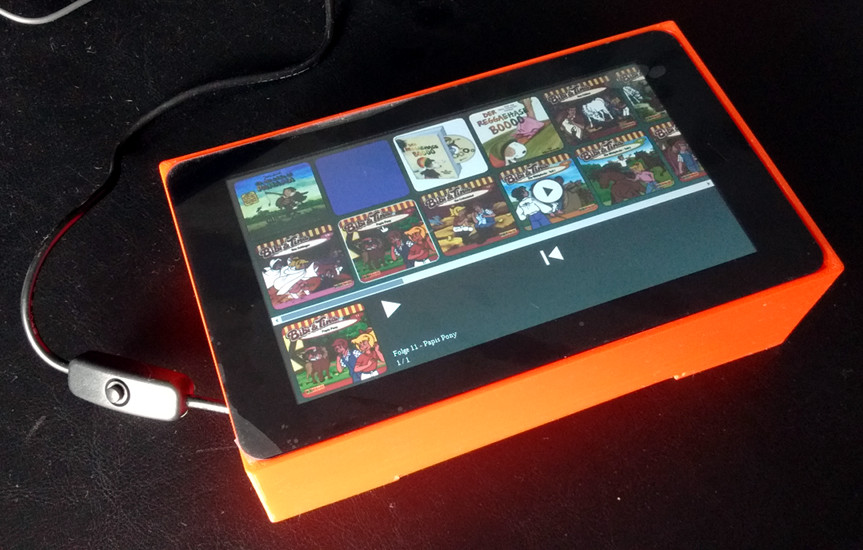
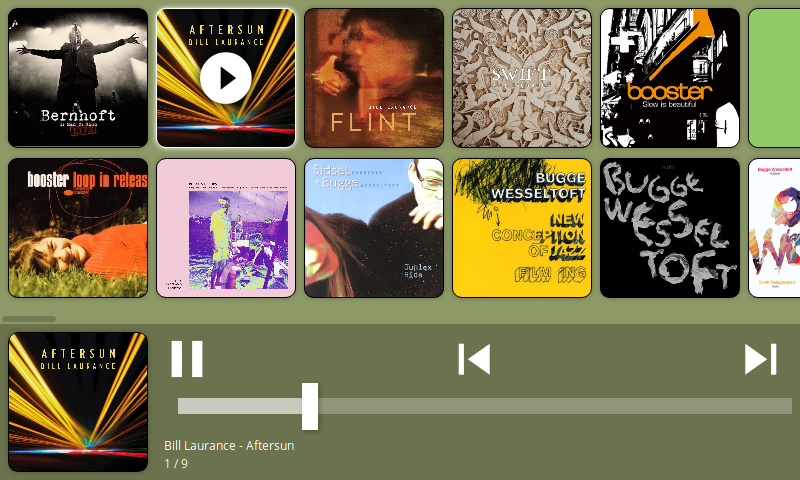

# Children Audio Library

Web based audio library for children. Made for the Raspberry Pi 7" Touchscreen.





## Goals

- [x] provide a children friendly touch interface for browsing and listening to music and audio books
- [x] make it work on the Raspberry PI Model 3 B together with the 7" Touchscreen
- [x] make it work on the included Chromium from Raspbian in kiosk mode
- [x] make it startup on boot and prevent escaping (escaping should only be possible with a keyboard)
- [x] make it read directories from a list of library folders (including external storages)
- [x] make it automaticly use existing cover art images
- [x] make it shutdown system after user action
- [x] make it work completly offline
- [x] provide a CLI to rescan library folder(s) and stop/start/maintain it

## Configuration

Copy `config.example.json` to `config.json` and adjust to your needs.

```javascript
{
  // list of paths to audio libraries
  "library": [
    "/media/pi"
  ],

  // port at which the server should run
  "port": 8000
}
```

See this [guide on getting bluetooth audio work](https://www.raspberrypi.org/magpi/bluetooth-audio-raspberry-pi-3/) on the Raspberry PI.

## Develop

```bash
LIBRARY_PATH=~/Music docker-compose up --build
```

Then in a second terminal do the following to scan the music library

```bash
docker-compose exec app
cargo run --bin cli scan
```

Now open your browser pointing to `http://localhost:8000`.

## Production

Do the configuration from above and then run:

```bash
cargo run --bin cli scan
cargo run --bin server
```

This will scan the library and then start the server.

Now open your browser pointing to `http://localhost:8000`.

To rescan the media library run:

```bash
cargo run --bin cli scan
```

It is recommended to add the `cargo run --bin cli scan` to a cron job or trigger it manually once you've added/changed the media library.

## On the Raspberry Pi

You must have rasbian installed on your Raspberry Pi.

Do the configuration from above and then run:

```bash
sudo ./raspi/setup.sh
sudo reboot
```

This will install all dependencies and make the audio library start on boot in kiosk mode.


## Credits

Icons by [fontawesome](https://fontawesome.com) under the [Font Awesome License](https://fontawesome.com/license#license).
